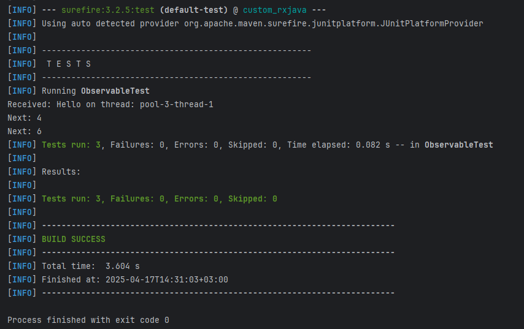

### **CustomRx – Легковесная реализация реактивных потоков**

**CustomRx** – это минималистичная реализация ключевых концепций **RxJava**, построенная на паттерне **Observer** и принципах реактивного программирования. Библиотека предоставляет инструменты для работы с асинхронными потоками данных, включая:
- **Операторы** (`map`, `filter`, `flatMap`) для преобразования и комбинирования потоков.
- **Управление многопоточностью** через `Scheduler`.
- **Обработку ошибок** и **отмену подписок** (`Disposable`).

---  

### **Архитектура**

#### **1. Observable\<T>**
Ядро библиотеки – источник данных, который:
- Создается через `create()`.
- Поддерживает подписку через `subscribe()`.
- Предоставляет цепочки операторов (`map`, `filter`, `flatMap`, `subscribeOn`, `observeOn`).

#### **2. Observer\<T>**
Интерфейс подписчика с колбэками:
- `onNext(T)` – новый элемент.
- `onError(Throwable)` – ошибка.
- `onComplete()` – завершение потока.

#### **3. Emitter\<T>**
Интерфейс для генерации событий (`onNext`, `onError`, `onComplete`).

#### **4. Disposable**
Контроль подписки: отмена для освобождения ресурсов.

---  

### **Операторы**

| Оператор | Действие |  
|----------|----------|  
| **map(Function\<T, R>)** | Преобразует каждый элемент. |  
| **filter(Predicate\<T>)** | Отсеивает элементы по условию. |  
| **flatMap(Function\<T, Observable\<R>>)** | "Разворачивает" вложенные потоки. |  
| **subscribeOn(Scheduler)** | Задает поток для выполнения `Observable`. |  
| **observeOn(Scheduler)** | Задает поток для обработки в `Observer`. |  

---  

### **Ключевые особенности**
✔ Простота и прозрачность работы (без сложных зависимостей).  
✔ Гибкость в управлении потоками и подписками.  
✔ Легковесная альтернатива для базовых сценариев Rx.

Подходит для проектов, где важны **контроль над исполнением** и **минимализм кода**.


## Многопоточность и Schedulers

### Интерфейс `Scheduler`:

```java
public interface Scheduler {
    void execute(Runnable task);
}
```
Интерфейс Scheduler определяет контракт для выполнения задач в разных потоках. Он используется в методах subscribeOn() и observeOn() у Observable, чтобы указать, в каком потоке должны происходить:
- генерация данных (subscribeOn)
- и/или их обработка (observeOn).

### Реализации `Scheduler'ов`:
#### `IOThreadScheduler`
```java
public class IOThreadScheduler implements Scheduler {
    private final ExecutorService executor = Executors.newCachedThreadPool();

    @Override
    public void execute(Runnable task) {
        executor.submit(task);
    }
}
```
- Использует CachedThreadPool, который создаёт потоки по мере необходимости и переиспользует их.
- Аналог `Schedulers.io()` в `RxJava`.
- **Применение:** сетевые запросы, файловый ввод-вывод, работа с базой данных — когда операций может быть много, но каждая из них не нагружает CPU.
#### `ComputationScheduler`
```java
public class ComputationScheduler implements Scheduler {
    private final ExecutorService executor = Executors.newFixedThreadPool(Runtime.getRuntime().availableProcessors());

    @Override
    public void execute(Runnable task) {
        executor.submit(task);
    }
}
```
- Использует фиксированное количество потоков, равное числу доступных процессоров.
- Аналог `Schedulers.computation()` в `RxJava`.
- **Применение:** операции, связанные с вычислениями, например, обработка данных, подсчёты, таймеры.
#### `SingleThreadScheduler`
```java
public class SingleThreadScheduler implements Scheduler {
    private final ExecutorService executor = Executors.newSingleThreadExecutor();

    @Override
    public void execute(Runnable task) {
        executor.submit(task);
    }
}
```
- Использует один поток для всех задач.
- Аналог `Schedulers.single()` в `RxJava`.
- **Применение:** последовательные задачи, когда важен порядок выполнения, например, логирование или работа с UI в тестовых сценариях.
### Тестирование:
Тесты написаны с использованием JUnit 5 и проверяют следующие сценарии:
- Корректность работы операторов map и filter
- Корректность работы flatMap
- Многопоточность через subscribeOn и observeOn
- Обработка ошибок через onError
- Завершение потока (onComplete)
- Синхронизация через CountDownLatch
#### Пример теста:
```Java
@Test
void testMapAndFilter() throws InterruptedException {
    CountDownLatch latch = new CountDownLatch(1);
    Observable.<Integer>create(emitter -> {
        emitter.onNext(1);
        emitter.onNext(2);
        emitter.onNext(3);
        emitter.onComplete();
    })
    .map(i -> i * 2)
    .filter(i -> i > 2)
    .subscribe(new Observer<Integer>() {
        public void onNext(Integer item) {
            System.out.println("Received: " + item);
        }
        public void onError(Throwable t) {
            fail();
        }
        public void onComplete() {
            latch.countDown();
        }
    });
    latch.await();
}
```
#### Примеры использования:
- Простая подписка с трансформацией
```Java
Observable.<Integer>create(em -> {
    em.onNext(10);
    em.onNext(20);
    em.onComplete();
})
.map(i -> i + 5)
.filter(i -> i > 20)
.subscribe(new Observer<>() {
    public void onNext(Integer i) {
        System.out.println("Result: " + i);
    }
    public void onError(Throwable t) {}
    public void onComplete() {
        System.out.println("Done");
    }
});
```
- Использование Schedulers
```Java
Observable.<String>create(em -> {
    em.onNext("Hello");
    em.onComplete();
})
.subscribeOn(new IOThreadScheduler())
.observeOn(new SingleThreadScheduler())
.subscribe(new Observer<>() {
    public void onNext(String item) {
        System.out.println("Thread: " + Thread.currentThread().getName());
    }
    public void onError(Throwable t) {}
    public void onComplete() {}
});
```
### Сборка и запуск:
Убедитесь, что в вашем `pom.xml` присутствует:
```xml
    <dependencies>
        <dependency>
            <groupId>junit</groupId>
            <artifactId>junit</artifactId>
            <version>4.13.2</version>
            <scope>test</scope>
        </dependency>
        <dependency>
            <groupId>org.junit.jupiter</groupId>
            <artifactId>junit-jupiter</artifactId>
            <version>RELEASE</version>
            <scope>test</scope>
        </dependency>
    </dependencies>
```
#### Запуск тестов:
`mvn test`
- Результат работы тестов:
  
### **CustomRx – Легковесная реализация реактивных потоков**

**CustomRx** – это минималистичная реализация ключевых концепций **RxJava**, построенная на паттерне **Observer** и принципах реактивного программирования. Библиотека предоставляет инструменты для работы с асинхронными потоками данных, включая:
- **Операторы** (`map`, `filter`, `flatMap`) для преобразования и комбинирования потоков.
- **Управление многопоточностью** через `Scheduler`.
- **Обработку ошибок** и **отмену подписок** (`Disposable`).

---  
